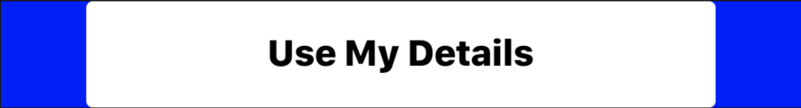

## Button

```json
{
	"id": 0,
	"type": "button",
	"title": "Use My Details",
	"links_to": 0,
	"buttonType": "warning",
	"theme": {
		"container": {
			"height": 50,
			"alignItems": "center",
			"justifyContent": "center",
			"flex": 1,
			"marginTop": 5,
			"marginBottom": 5
		},
		"button": {
			"height": 50,
			"justifyContent": "center",
			"alignSelf": "stretch",
			"backgroundColor": "white",
			"borderRadius": 3,
			"marginLeft": 40,
			"marginRight": 40
		},
		"buttonText": {
			"color": "black",
			"fontSize": 17,
			"fontWeight": "900",
			"alignSelf": "center"
		}
}
```

### Query Parameters

Parameter | Type | Description
--------- | ------- | -----------
id | Int | Id related to the module.
type | String | The type of module.
title | String | The title you would like inside the button.
links_to | Int | This is a unique page id. When clicking the button will route to this page.
buttonType | String | "warning", "success", "light", "info", "warning", "danger", "dark"
theme | Object | The theme of the button referenced below




### Theme Parameters

Parameter | Associated Color Area
--------- | -----------
buttonContainer | Blue
button | White
buttonText | Black