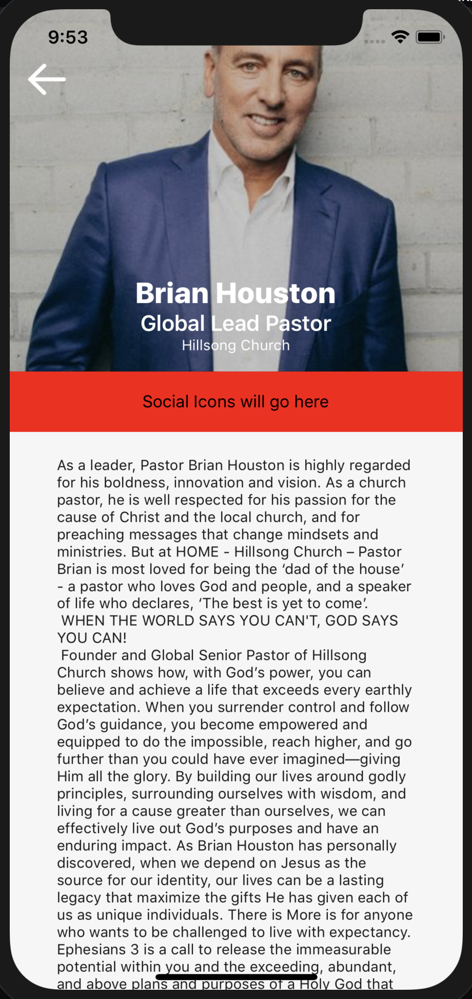

## FullBio



```json
{
	"id": 3,
	"title": "Brian Houston",
	"modules": [
		{
			"id": 1,
			"type": "fullbio",
			"links": [{ "id": 0, "title": "brianhouston.com", "links_to": "http://brianhouston.com" }, { "id": 1, "title": "hillsong.com", "links_to": "http://hillsong.com" }],
			"title": "Brian Houston",
			"secondaryTitle": "Global Lead Pastor",
			"tertiaryTitle": "Hillsong Church",
			"paragraph": "As a leader, Pastor Brian Houston is highly regarded for his boldness, innovation and vision. As a church pastor, he is well respected for his passion for the cause of Christ and the local church, and for preaching messages that change mindsets and ministries. But at HOME - Hillsong Church – Pastor Brian is most loved for being the ‘dad of the house’ - a pastor who loves God and people, and a speaker of life who declares, ‘The best is yet to come’. \n WHEN THE WORLD SAYS YOU CAN'T, GOD SAYS YOU CAN! \n Founder and Global Senior Pastor of Hillsong Church shows how, with God’s power, you can believe and achieve a life that exceeds every earthly expectation. When you surrender control and follow God’s guidance, you become empowered and equipped to do the impossible, reach higher, and go further than you could have ever imagined—giving Him all the glory. By building our lives around godly principles, surrounding ourselves with wisdom, and living for a cause greater than ourselves, we can effectively live out God’s purposes and have an enduring impact. As Brian Houston has personally discovered, when we depend on Jesus as the source for our identity, our lives can be a lasting legacy that maximize the gifts He has given each of us as unique individuals. There is More is for anyone who wants to be challenged to live with expectancy. Ephesians 3 is a call to release the immeasurable potential within you and the exceeding, abundant, and above plans and purposes of a Holy God that are beyond your greatest imagination.",
			"source_url": "https://www.premierproductions.com/sites/default/files/styles/500w/public/artists/brian_houston_-_cropped_2015_photo.jpg",
			"links_to": 2, 
			"theme": {
				"containerBackgroundColor": "transparent",
				"backgroundColor": "black",
				"borderRadius": 35,
				"borderColor": "black",
				"borderWidth": 0.5,
				"fontSize": 24,
				"fontSize2": 18,
				"fontSize3": 12,
				"fontColor": "white",
				"marginTop": 10,
				"marginLeft": 35,
				"imageSize": 70,
				"height": 300
			}
		}
	]
}
```

### Query Parameters

Parameter | Type | Description
--------- | ------- | -----------
id | Int | Id related to the module.
type | String | The type of module.
title | String | The title you would like inside the button.
links_to | Int | This is a unique page id. When clicking the button will route to this page.
buttonType | String | "warning", "success", "light", "info", "warning", "danger", "dark"
theme | Object | The theme of the button referenced below

### Theme Parameters

Parameter | Associated Color Area
--------- | -----------
buttonContainer | Blue
button | White
buttonText | Black