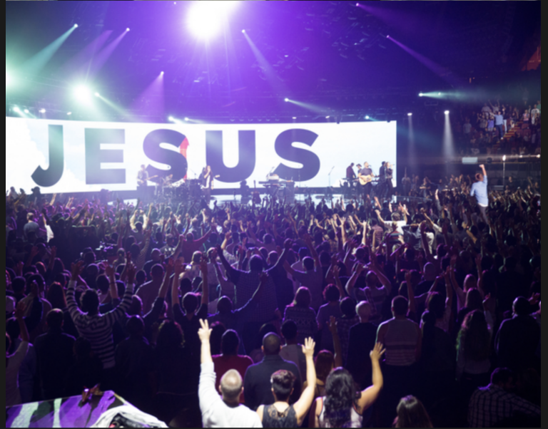

## Image



```json
{
	"id": 3,
	"type": "image",
	"source_url": "http://cdn.gospelherald.com/data/images/full/19347/hillsong-let-hope-rise.jpg",
	"theme": {
		"container": {
			"height": 300,
			"justifyContent": "center",
			"alignItems": "center"
		},
		"image": {
			"height": 300,
			"flex": 1,
			"width": null
		}
	}
}
```

### Query Parameters

Parameter | Type | Description
--------- | ------- | -----------
id | Int | Id related to the module.
type | String | The type of module.
source_url | String | Url to the image you would like to display
theme | Object | The theme of the image referenced below

### Theme Parameters

Parameter | Associated Color Area
--------- | -----------
container | null
image | null

For this example we are providing an image that takes up the full container.