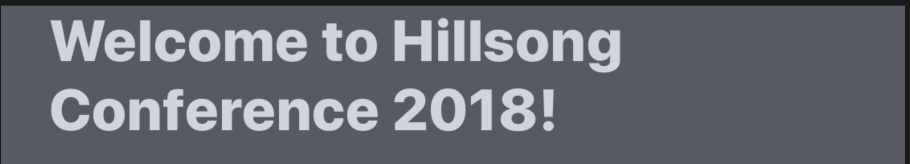

## Label


```json
{
	"id": 5,
	"type": "label",
	"content": "Welcome to Hillsong Conference 2018!",
	"theme": {
		"container": {
			"flex": 1, 
			"backgroundColor": "#F6F6F6", // Hillsong Theme
			"backgroundColor": "#575964"  // Default Theme
		},
		"text": {
			"fontWeight": "900",
			"color": "#191A1A", // Hillsong Theme
			"color": "#D0D4DC", // Default Theme
			"fontSize": 24,
			"marginLeft": 20,
			"marginRight": 20
		}
	}
}
```

### Query Parameters

Parameter | Type | Description
--------- | ------- | -----------
id | Int | Id related to the module.
type | String | The type of module.
content | String | The string you would like inside the label module. This can also be HTML
theme | Object | The theme of the button referenced below

### Theme Parameters

Parameter | Associated Color Area
--------- | -----------
container | White
text | Black

### Default Theme
