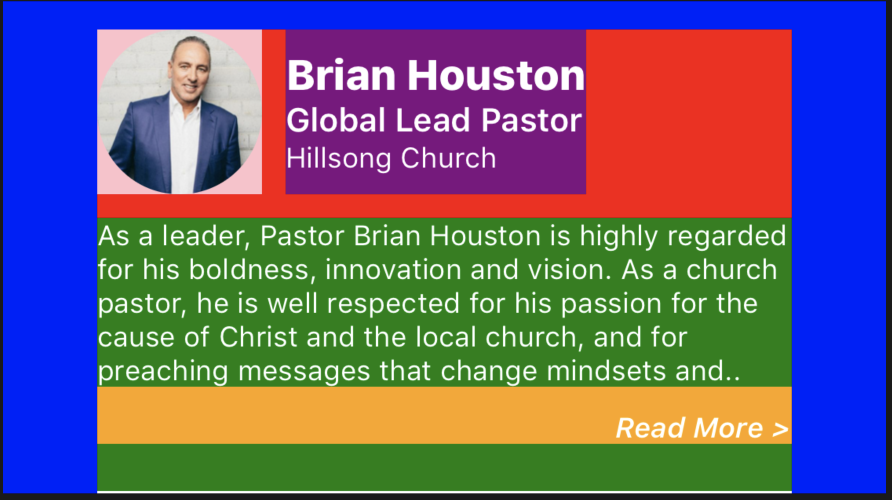

## MiniBio



```json
{
	"id": 1,
	"type": "minibio",
	"title": "Brian Houston",
	"secondaryTitle": "Global Lead Pastor",
	"tertiaryTitle": "Hillsong Church",
	"paragraph": "As a leader, Pastor Brian Houston is highly regarded for his boldness, innovation and vision. As a church pastor, he is well respected for his passion for the cause of Christ and the local church, and for preaching messages that change mindsets and..",
	"source_url": "https://www.premierproductions.com/sites/default/files/styles/500w/public/artists/brian_houston_-_cropped_2015_photo.jpg",
	"links_to": 3, 
	"theme": {
		"container": {
			"backgroundColor": "transparent",
			"paddingTop": 12
		},
		"containerContent": {
			"marginLeft": 40,
			"marginRight": 40
		},
		"topContainer": {
			"justifyContent": "flex-start",
			"paddingBottom": 10
		},
		"thumbnailContainer": {
			"marginRight": 10
		},
		"thumbnailImage": {
			"width": 70,
			"height": 70,
			"borderRadius": 35
		},
		"titleContainer": {
			"flexDirection": "column",
			"justifyContent": "center"
		},
		"title1": {
			"color": "white",
			"fontSize": 18,
			"fontWeight": "900"
		},
		"title2": {
			"color": "white",
			"fontSize": 14,
			"fontWeight": "bold"
		},
		"title3": {
			"color": "white",
			"fontSize": 12
		},
		"paragraphContainer": {
		},
		"paragraphText": {
			"color": "white",
			"fontSize": 12
		},
		"readMoreContainer": {
			"flex": 1,
			"alignItems": "flex-end"
		},
		"readMoreText": {
			"fontSize": 12,
			"alignSelf": "flex-end",
			"fontStyle": "italic",
			"fontWeight": "700"
		},
		"line": {
			"paddingTop": 20,
    		"borderBottomWidth": 1,
		}
	}
```

### Query Parameters

Parameter | Type | Description
--------- | ------- | -----------
id | Int | Id related to the module.
type | String | The type of module.
title | String | The top title string
secondaryTitle | String | The middle title string
tertiaryTitle | String | The last title string
paragraph | String | The paragraph description
source_url | String | The url of the image you would like to display
links_to | Int | The "page" you would like the read more button to link to
theme | Object | The theme of the minibio referenced below

### Theme Parameters

Parameter | Associated Color Area
--------- | -----------
container | Blue
containerContent | Green
topContainer | Red
thumbnailContainer | Pink
thumbnailImage | null
titleContainer | Purple
title1 | null
title2 | null
title3 | null
paragraphContainer | null
paragraphText | null
readMoreContainer | null
readMoreText | null
line | White

