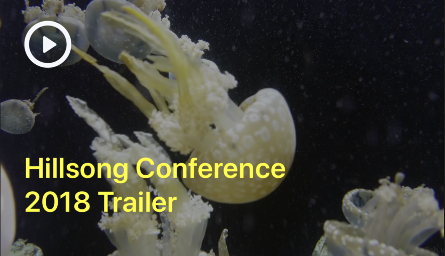

## Video

```json
{
	"id": 1,
	"type": "video",
	"source_url": "http://mirrors.standaloneinstaller.com/video-sample/jellyfish-25-mbps-hd-hevc.mp4", 
	"theme": {
		"container": {
			"height": 220
		},
		"videoContainer": {
			"height": 220,
			"justifyContent": "center",
			"alignItems": "center"
		},
		"video": {}, 
		"playButton": {},
		"videoTitleLabel": {
			"color": "white",
			"fontSize": 24,
			"width": 275,
			"marginLeft": 20,
			"marginTop": 20,
			"fontWeight": "700"
		}
	}
}
```

### Query Parameters

Parameter | Type | Description
--------- | ------- | -----------
id | Int | Id related to the module.
type | String | The type of module.
source_url | String | Url to the video you would like to show
theme | Object | The theme of the video referenced below




### Theme Parameters

Parameter | Associated Color Area
--------- | -----------
container | null
videoContainer | null
video | null
playButton | null
videoTitleLabel | yellow

For this example we are providing an video that takes up the full container.